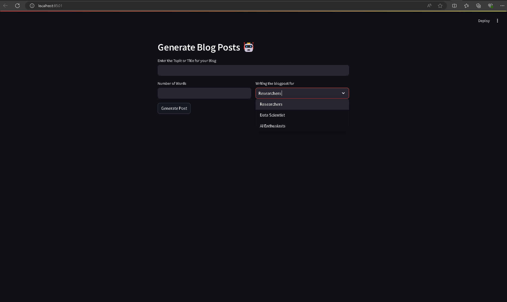

# AI Blog Post Generator 🤖

This project is an AI-powered blog post generator using the LLaMA-2 model. The application is built with Streamlit and leverages the LLaMA-2 model to generate blog posts based on user inputs.

## Features

- Generate blog posts tailored to different job profiles (Researchers, Data Scientists, AI Enthusiasts).
- Customize the length of the blog post.
- Easy-to-use web interface built with Streamlit.

## Screenshot



## Installation

1. **Clone the repository:**

    ```bash
    git clone https://github.com/dthatprince/genblog-llama2.git
    cd ai-blog-post-generator
    ```

2. **Create a virtual environment:**

    ```bash
    python -m venv venv
    ```

3. **Activate the virtual environment:**

    - On Windows:

        ```bash
        venv\Scripts\activate
        ```

    - On macOS and Linux:

        ```bash
        source venv/bin/activate
        ```

4. **Install the dependencies:**

    ```bash
    pip install -r requirements.txt
    ```

5. **Download the LLaMA-2 model:**

    Download the model file from [Hugging Face](https://huggingface.co/TheBloke/Llama-2-7B-Chat-GGML/tree/main) and place it in the `models` directory. Ensure the model file is named `llama-2-7b-chat.ggmlv3.q8_0.bin`.

6. **Run the Streamlit app:**

    ```bash
    streamlit run blogpost_generator_app.py
    ```

## Usage

1. Enter the topic or title for your blog.
2. Specify the number of words for the blog post.
3. Select the job profile for which the blog post is being written (Researchers, Data Scientists, AI Enthusiasts).
4. Click on "Generate Post" to create your blog post.

The generated blog post will be displayed on the page.

## License

This project is licensed under the MIT License. See the [LICENSE](LICENSE) file for details.

## Contributing

Contributions are welcome! Please open an issue or submit a pull request for any improvements or bug fixes.


